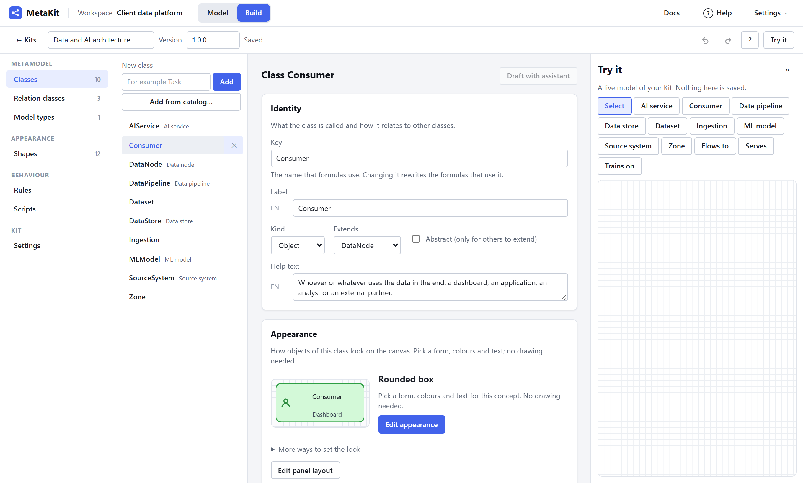
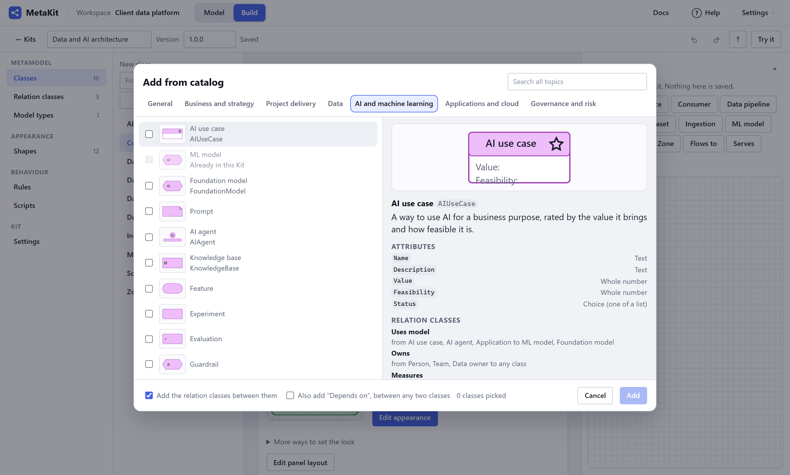
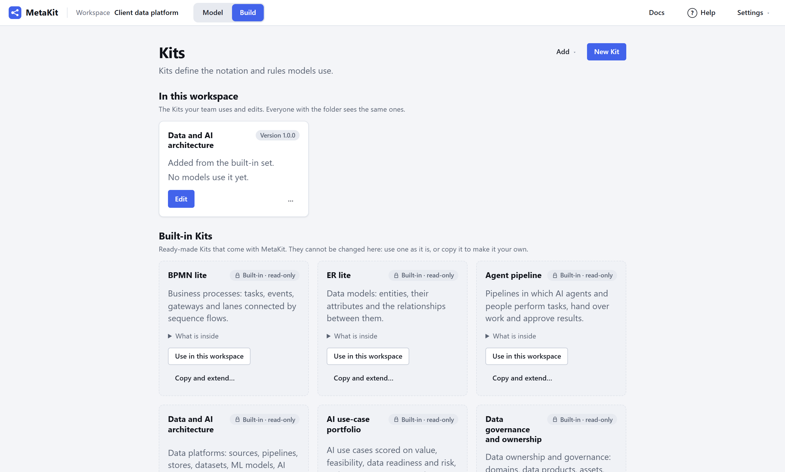
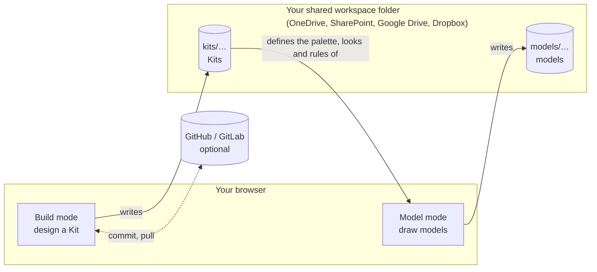
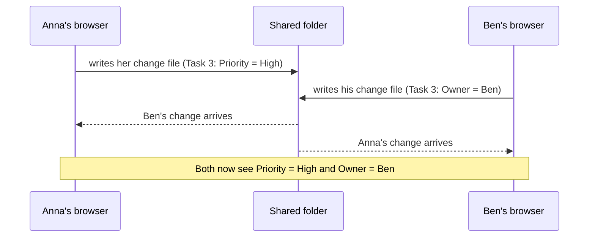
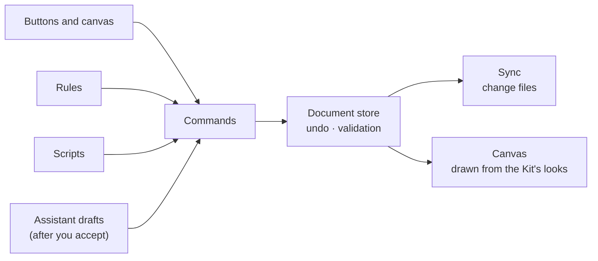

<div align="center">

# MetaKit

**Build your own modelling language. Then model with it, together.**

MetaKit is a free, open-source metamodelling and modelling tool that runs entirely in your browser.
Method engineers design **Kits**, which are modelling languages with their own concepts, notation, rules and scripts.
Modellers use those Kits to draw models, alone or with their team, in an ordinary shared folder.

[**Open MetaKit**](https://danxmd.github.io/MetaKit/) ·
[Quick start](#quick-start) ·
[Features](#what-you-can-do) ·
[How it works](#how-it-works) ·
[Run it locally](#run-it-locally) ·
[Support the project](#support-the-project)

<a href="https://buymeacoffee.com/danial.amlashi"></a>


</div>

## Why MetaKit

Most modelling tools give you a fixed notation, such as BPMN, ArchiMate or UML. Real projects rarely fit one of them exactly: a data platform review, an AI use-case portfolio or a governance model each need their own concepts, attributes and checks.

MetaKit lets you **make the notation fit the work**:

- **Build a Kit without writing code.** Pick concepts from a catalog, give them attributes and a look, connect them with relation classes, add rules, and try it live.
- **Model with it straight away.** Everything you change in a Kit shows in open models at once.
- **Keep your data yours.** There is no server, no database and no account. Kits and models are plain JSON files in a folder you choose, shared through OneDrive, SharePoint, Google Drive or Dropbox, or kept in GitHub or GitLab.
- **Work together.** Several people can edit the same model at the same time. Changes merge field by field, and you see who else is there.

## Who it is for

| You are…                                      | MetaKit helps you…                                                                                                                                                                           |
| --------------------------------------------- | -------------------------------------------------------------------------------------------------------------------------------------------------------------------------------------------- |
| A **consultant** in data and AI               | map a client's data platform and lineage, score an AI use-case portfolio, set up data ownership and governance, plan migrations and roadmaps, using ready-made Kits you can adapt per client |
| A **method engineer** or enterprise architect | design a modelling language for your organisation, with your concepts, rules and checks, and share it with your team                                                                         |
| A **modeller** or analyst                     | draw clear models with a palette that only offers what makes sense, live checks and computed values                                                                                          |
| A **teacher** or researcher                   | build teaching and research notations quickly and share them as a single file                                                                                                                |

## Quick start

1. **Open** [MetaKit](https://danxmd.github.io/MetaKit/) in Chrome or Edge on a desktop computer.
2. **Choose a workspace folder.** Pick an empty folder (it can be inside OneDrive or Google Drive) and create a workspace.
3. **Pick a Kit.** In **Build**, use one of the built-in Kits as it is, copy one and extend it, or start an empty one.
4. **Model.** In **Model**, choose **New model**, pick the Kit, then drag concepts from the palette onto the canvas and connect them.

Press **F1** at any time for help on the page you are on.

## What you can do

### Build Kits, without code



- **Concepts and relations.**
  - Classes with typed attributes: text, numbers, choices, dates, references, tables, links and formulas.
  - Relation classes with allowed ends.
  - Model types with views and cardinalities.
- **Add from catalog.** Ready-made, generic concepts in topic tabs, such as Dataset, Data pipeline, ML model, KPI, Risk, Stakeholder and Decision, each with attributes and a look. Add them in one step, then edit them freely.

  

- **Looks without drawing.** Pick a base form, colours, an icon and the fields to show; colour by any attribute; add badges. An advanced drawing editor is there when you need it.
- **Panel layouts** for the attribute panel, with tabs, groups and fields that show only when they apply.
- **Formulas** for computed values, defaults and constraints, such as `Likelihood * Impact` or `sum(children().Effort)`.
- **Rules** that react to 24 kinds of event and add commands to menus.
- **Scripts** in TypeScript for anything more, run in a sandbox, with permission prompts for the network and files.
- **Try it**: a live model of your Kit next to the editor while you build.

### Model, alone or together

- A palette with a preview of every concept, placing, connecting, containers and swimlanes, alignment and auto-layout.
- An attribute panel generated from the Kit, with inline checks.
- A problems list, find in a model, find across all models, folders, and a 30-day trash.
- Export as SVG, PNG or PDF; share models as files, bundles or CSV.
- Live collaboration in a shared folder, with presence and a field-by-field merge.

### Built-in Kits

| Kit                                 | What it is for                                                                                                    |
| ----------------------------------- | ----------------------------------------------------------------------------------------------------------------- |
| **Data and AI strategy**            | Vision, goals and objectives, value drivers, AI use cases and capabilities, a roadmap of initiatives and benefits |
| **Data and AI maturity assessment** | Capabilities scored now and as a target, with the gap, a priority and the actions that close it                   |
| **AI use-case portfolio**           | Use cases scored on value, feasibility, data readiness and risk, with a priority score and quadrants              |
| **KPI and metric tree**             | Outcome KPIs explained by driver and operational metrics, with targets and an on-track colour                     |
| **Data and AI architecture**        | Sources, pipelines, stores, datasets, ML models, AI services and consumers, with lineage and personal-data checks |
| **Data governance and ownership**   | Domains, data products, owners and stewards, policies, classifications and quality rules                          |
| **Agent pipeline**                  | AI agents and people performing tasks, handing over work and approving results                                    |
| **BPMN lite**                       | Business processes with tasks, events, gateways and lanes                                                         |
| **ER lite**                         | Entities, attributes and relationships                                                                            |



### Git mode and the assistant

- **Git mode:** keep a Kit in a GitHub or GitLab repository. Commit and push, pull with a field-by-field merge, and follow tagged releases.
- **Assistant (optional):** off by default, and uses your own API key. It drafts rules, scripts, shapes and classes from one sentence. You review every draft before anything changes.

## How it works

MetaKit is a set of static files. Everything runs in your browser, and your files go straight from the browser to your folder or Git host.



**Several people, one folder.** Each open copy of MetaKit writes only its own small change files. Everyone reads everyone else's and merges them field by field, so two people can edit the same model without overwriting each other. There is nothing to install on a server, and no lock to wait for.



**One change path.** Every change, whether from you, a rule, a script or the assistant, is a command. That gives you undo for everything, the same checks everywhere, and a clean history.



## Run it locally

You need [Node.js](https://nodejs.org) 22 or newer. Then start everything with one command:

- **Windows:** double-click `start.cmd`.
- **macOS or Linux:** run `./start.sh`.
- **Anywhere:** `pnpm start` (or `node scripts/start.js`).

It checks Node, installs or updates the dependencies (with [pnpm](https://pnpm.io), through Corepack if needed), starts the app and opens your browser. MetaKit has no server or database, so that is the whole system. Press Ctrl+C to stop.

| Option         | What it does                                              |
| -------------- | --------------------------------------------------------- |
| `--preview`    | Build for production and serve that, as GitHub Pages does |
| `--port 5200`  | Use another port (or set `PORT`)                          |
| `--no-install` | Skip the dependency check                                 |
| `--no-open`    | Do not open the browser                                   |

### Browsers

MetaKit needs the File System Access API to work with folders, so use **Chrome or Edge on a desktop computer**. Other browsers load the app and say so.

## For developers

<details>
<summary>Development setup, commands, layout and command line</summary>

You need Node.js 22 or newer and [pnpm](https://pnpm.io) 10 (`corepack enable` picks the pinned version).

```sh
pnpm install
pnpm dev          # serve the web app locally
```

| Command          | What it does                                                             |
| ---------------- | ------------------------------------------------------------------------ |
| `pnpm typecheck` | `tsc -b` for packages, `tsc` for the CLI, `svelte-check` for the web app |
| `pnpm lint`      | ESLint, then a Prettier check                                            |
| `pnpm format`    | Apply Prettier                                                           |
| `pnpm test`      | Unit and property tests (Vitest)                                         |
| `pnpm test:e2e`  | End-to-end tests (Playwright, Chromium)                                  |
| `pnpm bench`     | Canvas benchmark; fails when `bench/budget.json` is exceeded             |
| `pnpm build`     | Build the web app and the CLI                                            |

The first `pnpm test:e2e` needs Chromium: `pnpm --filter @metakit-app/web exec playwright install chromium`, or set `PW_CHROMIUM_PATH` to an installed Chromium.

**Layout**

```text
apps/web        the static web app (Vite + Svelte 5)
apps/cli        headless validation, export and import (Node.js)
packages/       core, sync, storage, formula, shapes, canvas, behaviour, assistant, ui, docs
kits/           the built-in Kits and their sample models
docs/           plan, phase briefs, decisions (ADRs)
openspec/       specs and change proposals
bench/          canvas and merge benchmarks
spikes/         phase-0 experiments
```

**Command line** (after `pnpm build`)

```sh
node apps/cli/dist/bin.js validate kits/bpmn-lite
node apps/cli/dist/bin.js validate kits/bpmn-lite/order-process.mkmodel.json --strict
node apps/cli/dist/bin.js validate my-workspace --json
node apps/cli/dist/bin.js export my-workspace/models/order --format json --out order.mkmodel.json
node apps/cli/dist/bin.js export-kit kits/bpmn-lite --out bpmn-lite.mkkit
node apps/cli/dist/bin.js import-kit bpmn-lite.mkkit --workspace my-workspace
```

`--help` lists every command. `validate` exits with 1 on errors (or on warnings with `--strict`). The names from before the Kit rename, `export-tool`, `import-tool`, `--tool` and `--no-tool`, still work.

**How the project is built**

- Every feature starts as an OpenSpec change in `openspec/changes/` and is approved before it is built.
- Architecture rules are in `CLAUDE.md`, decisions in `docs/decisions/`, and the full plan in `docs/implementation-plan.md`.
- Pull requests run typecheck, lint, unit tests, build, end-to-end tests, a canvas performance budget and a bundle-size report.
- Pushes to `main` deploy the app to GitHub Pages.

</details>

## Support the project

MetaKit is free and open source. If it saves you time, you can support its development:

<a href="https://buymeacoffee.com/danial.amlashi"></a>

[buymeacoffee.com/danial.amlashi](https://buymeacoffee.com/danial.amlashi)

## Licence

Apache-2.0. See [`LICENSE`](LICENSE) and [`NOTICE`](NOTICE).
